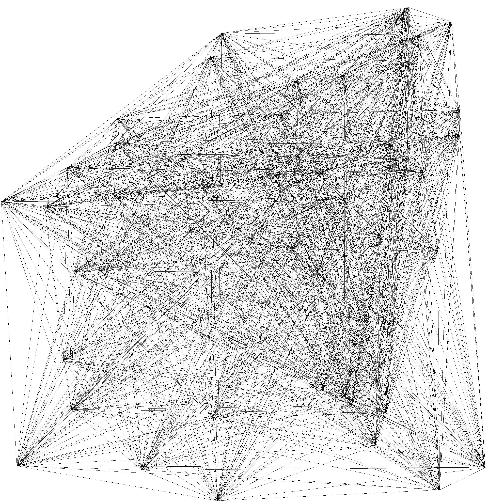

# Genuary 2022

I'm doing [Genuary](http://genuary.art/), an aritifiacilly generated month to build code that make beautiful things. Every day there is a new prompt for making new art with code.

To check out the prompts look [here](http://genuary.art/prompts).

I'm just starting to try out Generative art, so I'm doing the prompts that I found interesting.

### Requierements

to install the neccesary libraries to run the code, run the following command:

`pip install -r requierements/base.txt`

## Examples

Here is an example of day 7 prompt:

### Sol LeWitt Wall Drawing

## 

I've followed the instructions of _Sol Lewitt-Wall Painting 118_:

    “On a wall surface, any
    continuous stretch of wall,
    using a hard pencil, place
    fifty points at random.
    The points should be evenly
    distributed over the area
    of the wall. All of the
    points should be connected
    by straight lines. “
